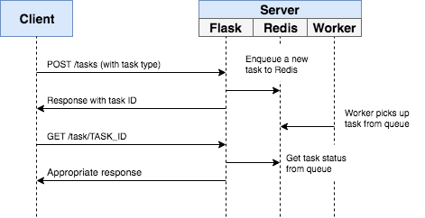

# Flask Redis Queue

Example of how to handle background processes with Flask, Redis Queue, and Docker



### Quick Start with Docker

Spin up the containers:

```sh
$ docker-compose up -d --build
```

Open your browser to http://localhost:5004


## Installation

Use the package manager [pip](https://pip.pypa.io/en/stable/) to install foobar.

```bash
pip install virtualenv

python3 -m venv env

source env/bin/activate

pip install --upgrade pip

pip install -r requirements.txt
```
## Run

```bash
python3 manage.py
```
